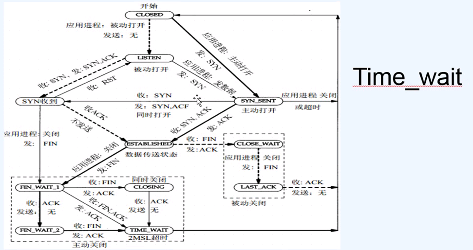

#单机时代
###什么是Socket？ 
####Socket五元组    
*源IP地址    
*源端口   
*目的IP地址   
*目的端口   
*类型：TCP or UDP   
####Tcp Socket四元组   
*源IP地址    
*源端口   
*目的IP地址   
*目的端口      
###TCP协议
```
#查看Linux机器端口
[root@centos7-1 ~]# cat /proc/sys/net/ipv4/ip_local_port_range 
32768	60999
#修改TPC端口
[root@centos7-1 ~]# echo "1000 61000" > /proc/sys/net/ipv4/ip_local_port_range
[root@centos7-1 ~]# cat /proc/sys/net/ipv4/ip_local_port_range 
1000	61000
[root@centos7-1 ~]# yum -y install httpd-devel
```


